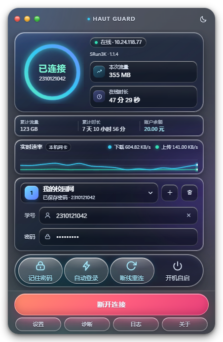
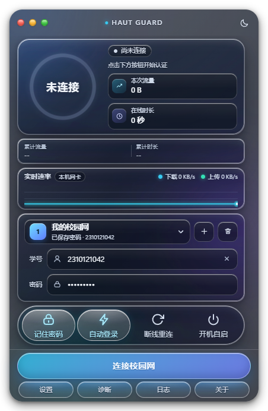
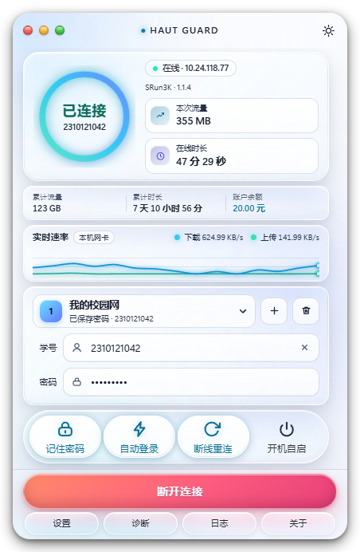
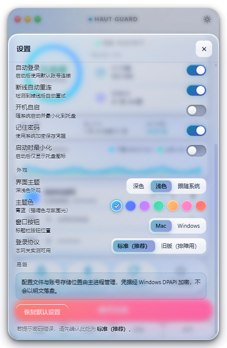

# HAUT Guard

深澜（SRun）校园网认证客户端。液态玻璃（Apple Liquid Glass 风格）界面，支持多账号切换、
实时速率曲线、断线自动重连、一键诊断等能力。

- 技术栈：Electron + 原生 CSS（`backdrop-filter` 真实背景模糊），零运行时依赖
- 协议：JS 实现与一份**已与真实网关验证过的** Python 参考实现逐字节对拍（2615 组向量），
  并用一个**独立实现**的模拟网关做端到端验证
- 交付：一键安装的 Windows EXE（NSIS，双击即装、装完即用）

> ⚠️ **非官方项目**。本项目与河南工业大学及深澜（SRun）厂商**没有任何关系**，不是校方发布的
> 软件，也不代表其立场。它使用学校网关对外提供的认证协议（因为网关只认这套协议），仅供学习
> 与技术交流使用，请遵守你所在学校的网络管理规定。
>
> 使用前请自行确认你的学校/单位允许使用第三方客户端。因使用本项目产生的一切后果由使用者自负。



更多界面（全部由 `tools/preview.js` 用虚构数据渲染，截图即代码）：

| 离线态 | 浅色主题 | 设置面板 | 开关条特写 |
| --- | --- | --- | --- |
|  |  |  |  |

`docs/ui/` 下还有 18 个场景的完整截图（在线/连接中/登录失败/自动重连/多账号/日志/首次运行/7 种主题色/Mac 与 Windows 两种窗口按钮/纯白与纯黑壁纸下的对比度测试等），
每个场景另有一张 `-bd` 后缀的"贴在壁纸上"的质感图。

---

## 一、功能

| 能力 | 说明 |
| --- | --- |
| 学号 / 密码登录 | 走 SRun portal 协议 |
| 在线状态与已用流量、在线时长 | 优先取网关的命名字段，位置解析仅作兜底 |
| 注销下线 | |
| 记住密码 | 密码经 Windows DPAPI（`safeStorage`）加密后落盘，磁盘上不出现明文 |
| 开机自启 | 写系统登录项（`HKCU\Software\Microsoft\Windows\CurrentVersion\Run`），`--hidden` 静默启动 |
| 系统托盘常驻 | 托盘菜单可快速连接 / 断开 |
| 错误码中文提示 | 覆盖 E2531/E2553/E2612 等 14 个常见码 |
| 诊断日志 | 带敏感信息脱敏与体积轮转 |
| 网关地址可配置 | 端口也可改，便于非标准部署与自测 |
| 多账号切换 | |
| 断线自动重连 | 指数退避 5s→10s→…→60s |
| 实时速率曲线 | 取自本机网卡统计（网关不提供实时流量，实测下载 21 MB 计数字段纹丝不动） |
| 账户余额 | 网关的 `user_balance` |
| 深浅色主题 | 深色 / 浅色 / 跟随系统 |
| 主题色自定义 | 7 种预设，影响强调色（按钮/状态环/开关高亮/图标）与窗口氛围光斑 |
| 窗口按钮风格 | Mac 交通灯（左上）/ Windows 式 `─` `✕`（右上），可切换 |
| 一键诊断 | 逐项检查并给出可读原因 |

### 明确的限制

1. **网关不提供实时流量，所以「实时速率」来自本机网卡。**
   实测（2026-09-18，HAUT 现网）：持续下载 20 秒共 **21 MB**，而状态接口的 `bytes_in`、
   `bytes_out`、`sum_bytes`、`all_bytes` **四个字段全都没有变化** —— 网关的计费计数只按很粗的
   周期刷新（分钟级）。因此：
   - 「实时速率」改由 `netstat -e` 读**本机网卡**累计字节数、每 3 秒采样算出（`src/main/netstat.js`）；
   - 它统计**本机所有网卡**的上下行，包含局域网流量，所以是"本机速率"而非"校园网流量"；
   - 若 `netstat` 不可用会自动退回"按网关计数差值估算"，并在日志里告警；
   - **「本次流量」「在线时长」在本地每秒推进**，不看网关的刷新节奏：
     - 在线时长 = 当前时间 − 会话开始时间（`addTime`），纯本地时钟，每秒跳一格；
     - 本次流量 = max（网关值，网关值 + 本机网卡增量），再按最近速率把"距离上一拍的时间"
       补进去（主进程 `monitor.js` 累加 + 渲染层每秒外推），**只增不减**；
   - 仍受网关刷新节奏影响的只有 **累计流量 / 累计时长 / 余额**，它们可能滞后几分钟才跳一次 ——
     那是网关的计费刷新周期，不是界面卡住。
2. **协议走明文 HTTP**。这是学校网关的既有约定，客户端无法单方面升级为 TLS。密码字段是
   应用层加密（hmac_md5 + xEncode）后传输，链路上不提供传输层保护。
3. **余额可能为 `null`**。部分固件不返回 `user_balance`，界面会隐藏该项而不是显示 0。
4. **未经真机验证的部分**见 `docs/校园网自测清单.md`。

---

## 二、架构

```
主进程 (Node)
├── main.js      窗口/托盘/开机自启/IPC 出口/状态推送
├── preload.js   与渲染层之间唯一的契约（contextBridge，契约文件）
├── srun.js      协议层：xEncode、自定义 base64、hmac_md5、sha1 chksum、HTTP
├── monitor.js   状态机：轮询、速率（本机网卡）、自动重连、自动登录
├── netstat.js   读本机网卡累计字节数（速率的真实来源）
├── store.js     配置与账号存储（密码经 DPAPI 加密）
├── diag.js      一键诊断
└── logger.js    日志（脱敏 + 轮转）
渲染进程 (Chromium)
├── index.html
├── styles/glass.css   液态玻璃样式
└── js/app.js, chart.js, mock.js
```

安全边界：渲染层 `contextIsolation: true`、`nodeIntegration: false`，只能通过
`window.haut` 调用白名单方法，不直接接触文件系统与网络。

### 状态接口的字段语义（真机实测，踩过坑）

`/cgi-bin/rad_user_info` 的**裸文本**响应在不同深澜固件里位置布局不一致。HAUT 现网
（网关 `1.01.20180614`）实测：裸文本有 21~22 段（尾部长度会浮动），而且：

| 位置 | 真实字段 | 含义 |
| --- | --- | --- |
| [0] | `user_name` | 学号 |
| [1] / [2] | `add_time` / `keepalive_time` | 本次登录时间 / 最近心跳时间 |
| [3] / [4] | `bytes_in` / `bytes_out` | **本次会话**下行 / 上行字节 |
| [6] / [7] | `sum_bytes` / `sum_seconds` | **账号累计**流量 / 累计在线秒数 |
| [8] | `online_ip` | 在线 IP |
| [11] | `user_balance` | 账户余额（元） |
| 末段 | `sysver` | 网关版本 |

因此客户端**优先请求带 `callback` 的 JSONP**，直接拿命名字段（无位置歧义）；只有当网关
不支持命名响应、返回裸文本时才退回位置解析（代码里 `statusFromText` 有两套布局分支）。

> 这个坑是这样被发现并锁住的：早期实现按位置把 `[3]` 当累计流量、`[4]` 当在线时长，
> 结果界面上会把 49 MB 的上行字节显示成「在线 595 天」。现在该行为被
> `test/status.test.js` 用**真机抓取的原文**固化成回归测试。

另有一处同类护栏：本次会话时长 = `keepalive_time - add_time`，如果网关给出的两个时间戳
不同源（时钟漂移或固件 bug），差值会算出「367 天」这种荒谬值。因此超过 30 天一律置 0
（表示不可信），而不是照实显示。见 `MAX_PLAUSIBLE_SESSION_SECONDS`。

开发时用来对拍的那份 Python 参考实现（不在本仓库内）原先也用了那套错误的位置映射，在 HAUT
现网上它的 `duration_text` 会输出「595 天 …」。**现已一并修正**：它同样改为优先取命名字段，
并加了相同的 30 天合理性护栏。`tools/live-check.js` 会逐字段比对两套实现，在真实网关上应当
6/6 一致（缺 Python 侧时会提示「Python 侧不可用」，此时请用 `tools/live-status.js` 只看 JS 结果）。

### 开机自启的实现

用系统登录项（`HKCU\Software\Microsoft\Windows\CurrentVersion\Run`，值名 `HAUT Guard`，
命令为 `<安装目录>\HAUT Guard.exe --hidden`），不需要额外的启动脚本或快捷方式文件。

启动时会**无条件同步**一次该登录项 —— 所以手工改过 `config.json`、或旧版本留下过自启项时，
注册表都会被纠正回配置的真实状态（不会出现"配置里关了、注册表还在"的幽灵自启）。

> ⚠️ 如果机器上还有别的校园网客户端也设了开机自启，两者会在登录时同时启动。
> 建议只保留一个，避免多个客户端对同一条认证会话各自动作。

### 为什么协议层要移植两次

协议层为什么要有两套独立验证：开发时先有一份**已与真实网关验证过**的 Python 参考实现
（不在本仓库内）。为了既复用它、又不让 JS 版本「看起来对」，做法是：

1. 用那份 Python 参考导出 2000+ 组对拍向量（含中文、emoji、边界长度、三种 `info` 格式），
   冻结成仓库里的 `test/vectors.json`；
2. JS 实现逐条比对，要求**逐字节一致**（`node test/vectors.test.js`，2615/2615）；
3. 另有一个**独立实现**的模拟网关（`test/mock-gateway.js`），它在服务端重新实现校验逻辑，
   会真的校验 `chksum` 与 `info` —— 伪造签名必须被拒绝。这样客户端加密才算被真正验证。

---

## 三、开发

环境要求：Windows 10/11、Node.js ≥ 20（开发用 24.20.0）、Python 3.10（仅用于生成对拍向量）。

```powershell
# 安装依赖（Electron 二进制走国内镜像）
$env:ELECTRON_MIRROR = "https://npmmirror.com/mirrors/electron/"
npm install
# npm 11 默认拦截安装脚本，若 node_modules/electron/dist/electron.exe 不存在，手动补一次：
cd node_modules\electron; node install.js; cd ..\..

npm start          # 启动应用
npm run dev        # 启动并打开开发者工具
npm test           # 跑全部测试
```

### 测试

```powershell
node test\all.js
```

| 测试 | 内容 |
| --- | --- |
| `store.test.js` | 配置校验、账号增删改、密码只以密文落盘、日志脱敏、BOM/损坏文件的容错 |
| `status.test.js` | 状态解析回归：用**真机抓取的原文**锁定字段语义（含"595 天"那个坑） |
| `vectors.test.js` | JS 协议实现 vs Python 参考实现，逐字节对拍（2615 条） |
| `mock.test.js` | 模拟网关端到端：登录/各类错误码/注销/伪造签名被拒/断网/自动重连/自动登录/诊断 |

重新生成对拍向量（改动了 Python 参考实现时需要）：

```powershell
cd test; python gen_vectors.py
```

### 对真实网关的只读校验

两个工具都**只调用 `rad_user_info` / `get_challenge`**，不会登录或注销，不需要账号密码：

```powershell
node tools\live-status.js            # 打印当前在线状态的所有字段(人类可读)
node tools\live-check.js             # JS 实现 vs Python 参考实现, 逐字段交叉比对
```

### 生成图标

```powershell
node_modules\electron\dist\electron.exe tools\make-icon.js
```

### 端到端联调（不需要校园网）

```powershell
pwsh -File tools\integration-app.ps1
```

它会：启动模拟网关（预置一个在线会话 + 每秒模拟流量增长）→ 把 `config.json` 临时指向它 →
启动真实应用 → 检查本次运行日志里有没有 `[ERROR]` 或渲染层异常 → 给窗口截一张系统级截图 →
还原原配置并清理进程。任何一环失败都以非 0 退出。

**注意系统级截图的局限**：窗口被别的窗口遮挡时会截到遮挡它的内容。要拿到可靠的界面截图，
用应用自带的测试开关（直接取本窗口渲染结果，不受遮挡影响）：

```powershell
electron . --capture=docs\ui\shot.png --capture-exit --capture-delay=6000
```

`--capture=<路径>` 在界面渲染稳定后截图存盘；`--capture-exit` 表示截完就退出；
`--capture-delay` 控制等待毫秒数（默认 4000）。正常使用不会触发。

### 四个必须知道的坑1. **`.ps1` 文件必须带 UTF-8 BOM**。本机的 Windows PowerShell 在读取无 BOM 的脚本时按
   ANSI 解码，脚本里的中文会破坏引号配对，直接报一堆 `Missing closing '}'`。
   注意用编辑工具改动 `tools\*.ps1` 后 BOM 会丢失，需要重新补上：
   ```powershell
   $enc = New-Object System.Text.UTF8Encoding($true)
   $t = [System.IO.File]::ReadAllText($f, (New-Object System.Text.UTF8Encoding($false)))
   [System.IO.File]::WriteAllText($f, $t.TrimStart([char]0xFEFF), $enc)
   ```
2. **`electron.exe` 是 GUI 子系统程序**，从 PowerShell 直接调用不会等待它，输出也拿不到。
   要等它跑完必须用 `Start-Process -Wait -NoNewWindow`。
   同理，**判断日志里的级别不要用 `-like '*[ERROR]*'`** —— PowerShell 的 `-like` 把 `[]`
   当字符类，会把所有含 E/R/O 的行都匹配上；要用 `-match '\[ERROR\]'`。
3. **`powershell.exe` 不在 PATH 里**。本机 `C:\Windows\System32\WindowsPowerShell\v1.0`
   存在但未加入 PATH，而 electron-builder 收集依赖时会 `spawn powershell.exe`，
   于是打包在最后一步报 `spawn powershell.exe ENOENT`。`tools\build.ps1` 会自己把它加进
   PATH；如果你手工执行 `npx electron-builder`，需要先：
   ```powershell
   $env:PATH = "$env:SystemRoot\System32\WindowsPowerShell\v1.0;$env:PATH"
   ```
4. **透明窗口 + CSS 圆角会「四个角发白」**。透明窗口在 CSS 圆角之外是**完全透明**的 ——
   背后是什么就露出什么。如果背后恰好是个白色窗口，四个角看起来就是白块，很像样式没生效
   （实测：把应用最小化前后，四角像素完全相同，证明那不是应用画的）。
   解决：窗口比面板大一圈（本项目 16px，见 `main.js` 的 `WINDOW_MARGIN` 与 CSS 里的
   `inset: 16px`），并给面板加 CSS 投影，投影落在透明边距里 —— 这样窗口才读起来像一张
   悬浮卡片。投影的模糊半径要小于边距，否则会被窗口边缘硬切。
   另外：**不要给这个窗口设置任何系统背景材质**（`setBackgroundMaterial`）。窗口是
   `transparent: true` 创建的，一旦设置过材质（哪怕是 `"none"`），Chromium 就会离开
   "分层窗口 + 逐像素透明"路径，圆角外立刻变白。因此 `supportedMaterials()` 只返回
   `transparent`，设置面板里也不再提供"亚克力/云母"选项 —— 它们需要不透明窗口，
   与 CSS 圆角方案互斥（即使能显示，材质也会在圆角外露出直角背板）。

---

## 四、打包

```powershell
$env:ELECTRON_MIRROR = "https://npmmirror.com/mirrors/electron/"
$env:ELECTRON_BUILDER_BINARIES_MIRROR = "https://npmmirror.com/mirrors/electron-builder-binaries/"
npm run dist
```

产物：`dist\HAUT-Guard-Setup-<版本>.exe`（NSIS 一键安装：单用户安装、无需管理员、
自动创建桌面与开始菜单快捷方式、安装完成后自动启动）。

配置数据位置：`%APPDATA%\HAUT Guard\`（`config.json`、`accounts.json`、`logs\`）。
卸载时保留该目录，避免误删账号。

---

## 五、排障

1. 点界面底部「诊断」，它会逐项检查：配置、本机 IP、网关端口连通性、状态接口、令牌接口、
   凭据加密、日志目录可写。
2. 日志文件：`%APPDATA%\HAUT Guard\logs\haut-guard.log`（界面「日志」面板也能看，可一键打开目录）。
3. 常见结论：
   - 「无法连接认证网关」→ 不在校园网内，或网关地址/端口填错；
   - `E3005` → 签名校验失败，通常是网关固件版本与 `passwordAlgo` / `infoFormat` 不匹配，
     在「设置」里切换这两个选项重试；
   - 「系统凭据加密不可用」→ 当前系统账户无法使用 DPAPI，密码不会被保存。

---

## 六、关于隐私与版权（本仓库**不含**什么）

为了不泄露个人信息、也不夹带他人代码，下面这些内容**没有**进仓库（`.gitignore` 里已排除，
其中部分在开发机上保留于 `_private/`）：

| 未包含 | 原因 |
| --- | --- |
| 任何真实学号、内网 IP、MAC | 已从代码与文档中替换为占位符（`20230001` / `10.20.30.40` / `aa:bb:cc:dd:ee:ff`） |
| 真实环境下的界面截图与抓包（`_private/`） | 截图里能看到真实学号、IP 与桌面壁纸 |
| `tools/gateway_js/`、`tools/login_page.html` | 这是**学校网关/深澜厂商自己派发的前端代码副本**，版权属于对方，不宜再分发 |
| `node_modules/`、`dist/` | 体积过大（449 MB / 475 MB），且安装包超过 GitHub 单文件上限 |

因此 `docs/ui/` 里的截图全部由 `tools/preview.js` 用**虚构数据**渲染；仓库内所有夹具账号都是
`20230001` / `20230002` 这类假号。另外，`test/gen_vectors.py` 与 `test/integration_python.py`
依赖一份**仓库外**的 Python 参考实现才能运行（仓库里的 `test/vectors.json` 就是它导出的冻结产物，
Node 侧测试不需要 Python）。

## 七、许可

[MIT](LICENSE)。注意：MIT 只覆盖本仓库的代码；你所在学校的网关与厂商前端代码不在此许可范围内。

## 八、下载安装

到 [Releases](../../releases) 页面下载 `HAUT-Guard-Setup-<版本>.exe`（约 106 MB），双击安装：

- 单用户安装，**不需要管理员权限**；自动创建桌面与开始菜单快捷方式；装完自动启动
- 安装包**没有数字签名**，Windows 会提示「未知发布者」，点「更多信息 → 仍要运行」即可
- 卸载：设置 → 应用 → 卸载，或安装目录里的 `Uninstall HAUT Guard.exe`
  （卸载**不会**删除 `%APPDATA%\HAUT Guard\`，避免误删你的账号配置）
- 首次使用请在「设置」里填你学校的**网关地址与端口**，以及你自己的学号密码

> 各校网关固件不同：若登录报 `E3005` 或「密码算法不符」，到「设置 → 登录协议」换另一项再试。

